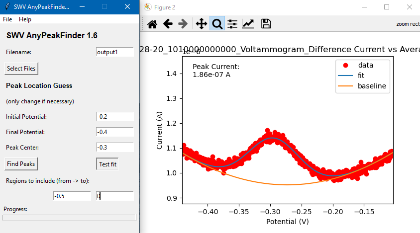

# SWV AnyPeakFinder

This program finds peak height values (i.e., peak currents) from .txt files and .csv files containing squarewave voltammogram data, using any selected files.

  [](https://lgtm.com/projects/g/Paradoxdruid/SWVAnyPeakFinder/context:python)  [](https://www.codefactor.io/repository/github/paradoxdruid/swvanypeakfinder) [](https://github.com/ambv/black)




## Installation

```bash
pip install SWV_AnyPeakFinder
```

## Getting Started

To run the program:

```bash
swv_anypeakfinder
```

or

```
python SWV_AnyPeakFinder.py
```

## Authors

## Authors
This software is developed as academic software by [Dr. Andrew J. Bonham](https://github.com/Paradoxdruid) at the [Metropolitan State University of Denver](https://www.msudenver.edu). It is licensed under the LGPL v3.0.
